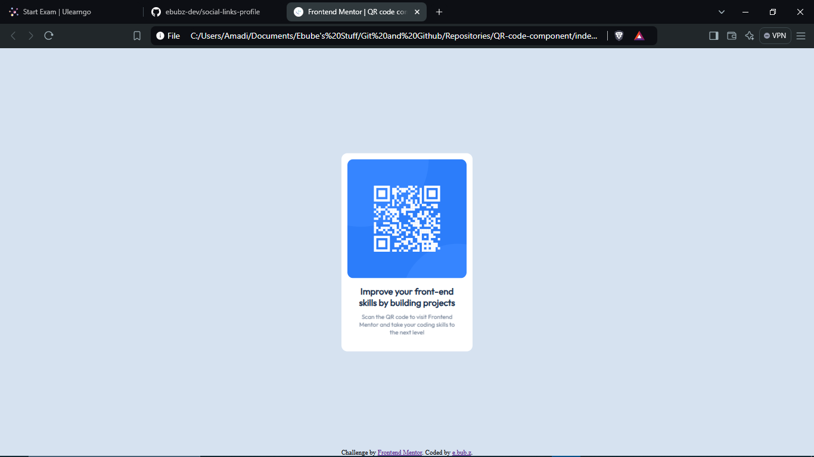

# Frontend Mentor - QR code component solution

This is a solution to the [QR code component challenge on Frontend Mentor](https://www.frontendmentor.io/challenges/qr-code-component-iux_sIO_H). Frontend Mentor challenges help you improve your coding skills by building realistic projects. 

## Table of contents

  - [Screenshot](#screenshot)
  - [Links](#links)
  - [Built with](#built-with)
- [Author](#author)

### Screenshot

### Links

- Solution URL: [https://github.com/ebubz-dev/QR-code-component](https://github.com/ebubz-dev/QR-code-component)
- Live Site URL: [https://ebubz-dev.github.io/QR-code-component/](https://ebubz-dev.github.io/QR-code-component/)

### Built with

- Semantic HTML5 markup
- CSS custom properties

## Author

- Website - [Ebube](https://ebubz-dev.github.io)
- Frontend Mentor - [@ebubz-dev](https://www.frontendmentor.io/profile/ebubz-dev)
